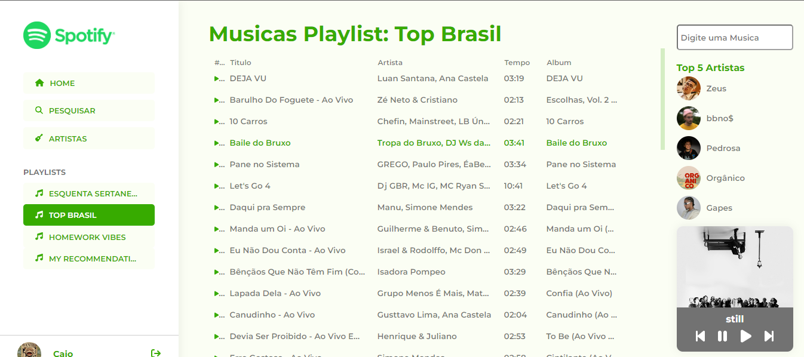

# <h1 align="center">Projeto Clone Spotify</h1>

 
## 📗 Sobre o Projeto

O Projeto Clone Spotify tem como objetivo desenvolver uma interface inspirada no Spotify, utilizando o poderoso framework Angular e a API oficial do Spotify.

## 🔨 Ferramentas e Bibliotecas

O projeto faz uso das seguintes ferramentas e bibliotecas:

- [Angular](https://angular.io/): Um framework poderoso e modular para construir aplicativos web escaláveis.
- [Spotify API](https://developer.spotify.com/documentation/web-api): A API oficial do Spotify, proporcionando acesso a uma variedade de recursos, incluindo informações sobre artistas, álbuns e faixas.

## 🔧 Funcionalidades

O Projeto Clone Spotify visa implementar as seguintes funcionalidades:

- Navegação intuitiva e amigável, assemelhando-se à interface do Spotify.
- Exibição de informações sobre artistas, álbuns e faixas.
- Integração com a Spotify API para fornecer dados em tempo real.

## 🚀 Como Executar

1. Clone o repositório.
2. Instale as dependências usando `npm install`.
3. Inicie o servidor de desenvolvimento com `ng serve`.
4. Acesse o aplicativo em `http://localhost:4200/`.
5. Abra o seu Spotify